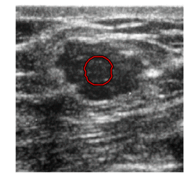
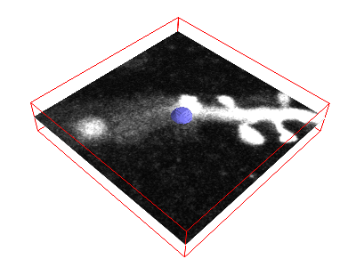
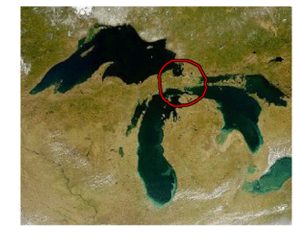
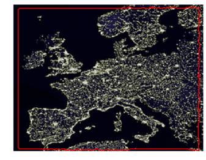
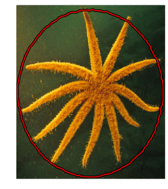

# Morphological Snakes

[](https://travis-ci.org/pmneila/morphsnakes)
[](https://codecov.io/gh/pmneila/morphsnakes)
<!-- [](https://www.codacy.com/app/Borda/morph-snakes?utm_source=github.com&amp;utm_medium=referral&amp;utm_content=Borda/morph-snakes&amp;utm_campaign=Badge_Grade)
[](https://landscape.io/github/Borda/morph-snakes/master) -->

**morphsnakes** is an implementation of the *Morphological Snakes* for image segmentation.
**morphsnakes** supports 2D images and 3D volumes.




*Morphological Snakes* [1][2] are a family of methods for image segmentation.
Their behavior is similar to that of *Active Contours* like *Geodesic
Active Contours* [3] or *Active Contours without Edges* [4]. However,
traditional approaches for *Active Contours* require solving PDEs over
floating points arrays, which is slow and might have numerical stability issues.
Instead of PDEs, *Morphological Snakes* use morphological operators
-such as dilation or erosion- over a binary array. This makes
*Morphological Snakes* faster and numerically more stable than their
traditional counterparts.

Two *Morphological Snakes* methods are available in **morphsnakes**:

* *Morphological Geodesic Active Contours*, or **MorphGAC**, implemented in the
  function ``morphological_geodesic_active_contour``,
* *Morphological Active Contours without Edges*, or **MorphACWE**, implemented in
  the function ``morphological_chan_vese``.

## Installation

### Option 1: Copy `morphsnakes.py` to your project

All the required code is contained in [`morphsnakes.py`](morphsnakes.py). You can
copy this file into your own project with
```
wget https://raw.githubusercontent.com/pmneila/morphsnakes/master/morphsnakes.py
```

### Option 2: `pip install`

It is also possible to install **morphsnakes** with `pip`
```
pip install morphsnakes
```


## Getting started

The file [`examples.py`](examples.py) contains multiple examples of **MorphGAC**
and **MorphACWE**. You can take any example from that file as a starting point for
your project.

## What are the differences between **MorphGAC** and **MorphACWE**?

### MorphACWE

**MorphACWE** works well when pixel values of the inside
and the outside regions of the object to segment have different averages.
Unlike **MorphGAC**, **MorphACWE** does not require that the contours of the
object are well defined, and it can work over the original image without any
preprocessing. 

**MorphACWE** is much easier to setup and use than **MorphGAC**, and much more
robust to noise. You should try using **MorphACWE** first, and only switch
to **MorphGAC** when it is clear to you that **MorphACWE** is not suitable
for the kind of images you are working with.




### MorphGAC

**MorphGAC** is suitable for images with visible contours, even when these
contours might be noisy, cluttered, or partially unclear. It requires, however,
that the image is preprocessed to highlight the contours. This can be done
using the function ``inverse_gaussian_gradient``, although you might want
to define your own version. The quality of the **MorphGAC** segmentation
depends greatly on this preprocessing step.




## References

[1]: *A Morphological Approach to Curvature-based Evolution of Curves and
    Surfaces*, Pablo Márquez-Neila, Luis Baumela and Luis Álvarez. In IEEE
    Transactions on Pattern Analysis and Machine Intelligence (PAMI),
    2014, DOI 10.1109/TPAMI.2013.106

[2]: *Morphological Snakes*. Luis Álvarez, Luis Baumela, Pablo Márquez-Neila.
   In Proceedings of the IEEE Conference on Computer Vision and Pattern Recognition 2010 (CVPR10).

[3]: *Geodesic Active Contours*, Vicent Caselles, Ron Kimmel and Guillermo
    Sapiro. In International Journal of Computer Vision (IJCV), 1997,
    DOI:10.1023/A:1007979827043

[4]: *Active Contours without Edges*, Tony Chan and Luminita Vese. In IEEE
    Transactions on Image Processing, 2001, DOI:10.1109/83.902291
