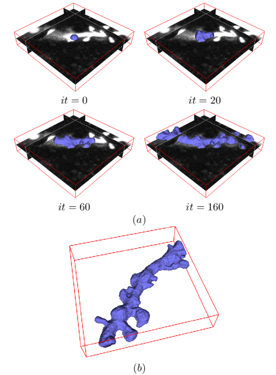

# Morphological Snakes

[](https://travis-ci.org/pmneila/morphsnakes)
<!-- [](https://codecov.io/gh/Borda/morph-snakes)
[](https://www.codacy.com/app/Borda/morph-snakes?utm_source=github.com&amp;utm_medium=referral&amp;utm_content=Borda/morph-snakes&amp;utm_campaign=Badge_Grade)
[](https://landscape.io/github/Borda/morph-snakes/master) -->

*Morphological Snakes* [1,2] are a family of methods for image segmentation.
Their behavior is similar to that of active contours (for example, *Geodesic
Active Contours* [3] or *Active Contours without Edges* [4]). However,
*Morphological Snakes* use morphological operators (such as dilation or
erosion) over a binary array instead of solving PDEs over a floating point
array, which is the standard approach for active contours. This makes
*Morphological Snakes* faster and numerically more stable than their
traditional counterparts.

There are two *Morphological Snakes* methods available in this implementation:
*Morphological Geodesic Active Contours* (**MorphGAC**, implemented in the
function ``morphological_geodesic_active_contour``) and *Morphological Active
Contours without Edges* (**MorphACWE**, implemented in the function
``morphological_chan_vese``).

## Installation

### Option A: Copy `morphsnakes.py` to your project

All the required code is contained in `morphsnakes.py`. You can download and copy this file into your own project with:
```
wget https://raw.githubusercontent.com/pmneila/morphsnakes/master/morphsnakes.py
```

### Option B: `pip install`

It is also possible to install *Morphological Snakes* with `pip`:
```
pip install morphsnakes
```

## Examples

The file `examples.py` contains some usage examples.

The images below show some working examples of the *Morphological Snakes*.

### MorphGAC


### MorphACWE


## Comparison





## References

[1]: *A Morphological Approach to Curvature-based Evolution of Curves and
    Surfaces*, Pablo Márquez-Neila, Luis Baumela and Luis Álvarez. In IEEE
    Transactions on Pattern Analysis and Machine Intelligence (PAMI),
    2014, DOI 10.1109/TPAMI.2013.106
[2]: *Morphological Snakes*. Luis Álvarez, Luis Baumela, Pablo Márquez-Neila.
   In Proceedings of the IEEE Conference on Computer Vision and Pattern Recognition 2010 (CVPR10).
[3]: *Geodesic Active Contours*, Vicent Caselles, Ron Kimmel and Guillermo
    Sapiro. In International Journal of Computer Vision (IJCV), 1997,
    DOI:10.1023/A:1007979827043
[4]: *Active Contours without Edges*, Tony Chan and Luminita Vese. In IEEE
    Transactions on Image Processing, 2001, DOI:10.1109/83.902291
